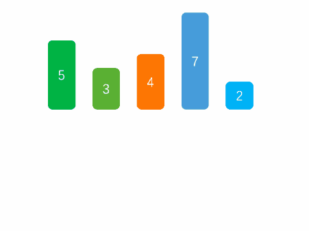

1. 思路



将左侧序列看成一个有序序列，每次将一个数字插入该有序序列。
插入时，从有序序列最右侧开始比较，若比较的数较大，后移一位。

2. 解法

```js
function insertSort(arr) {
  // 从第 1 位开始，前面留有一位
  for (let i = 1; i < arr.length; i++) {
    let target = i;
    for (let j = i - 1; j >= 0; j--) {
      if (arr[target] < arr[j]) {
        [arr[target], arr[j]] = [arr[j], arr[target]]; // 交换位置
        target--;
      } else {
        break;
      }
    }
  }
  return arr;
}
```

时间复杂度：O(n^2)

空间复杂度:O(1)
