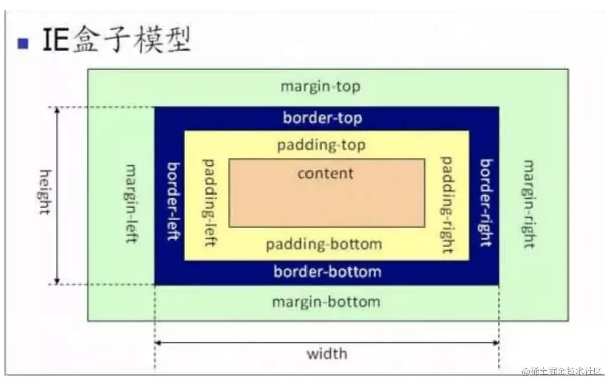

## CSS 盒模型

当对一个文档进行布局的时候，浏览器的渲染引擎会根据标准之一的 CSS 基础框盒模型（CSS basic box model），将所有元素表示为一个个矩形的盒子（box）。CSS 决定这些盒子的大小、位置以及属性（例如颜色、背景、边框尺寸…）。

1. W3C 标准盒模型
   每个盒子由四个部分（或称区域）组成，分别为：内容区域 content area、内边距区域 padding area、边框区域 border area 、外边距区域 margin area，分别对应 width、height、padding、border、margin。
   

2. IE 盒模型：
   属性 width,height 包含 border 和 padding，指的是 content+padding+border。
   

在 ie8+ 浏览器中使用哪个盒模型可以由 box-sizing(CSS 新增的属性)控制，默认值为 content-box，即标准盒模型；如果将 box-sizing 设为 border-box 则用的是 IE 盒模型
