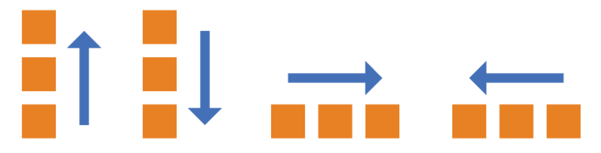
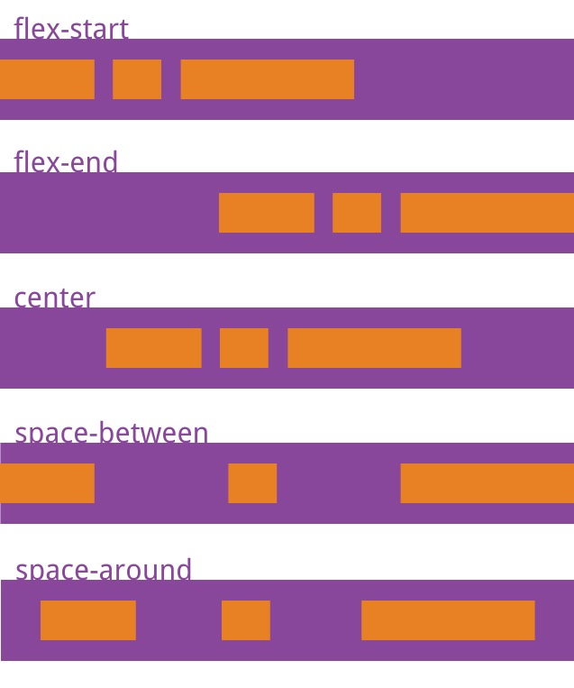
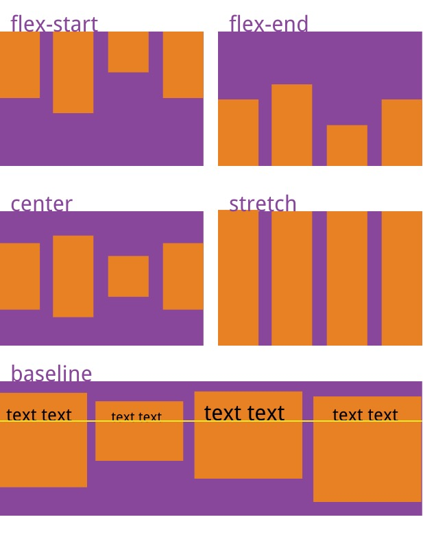
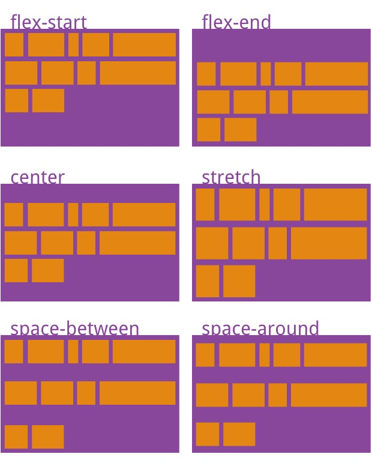

## flex 弹性布局

采用 Flex 布局的元素，称为 Flex 容器（flex container），简称"容器"。它的所有子元素自动成为容器成员，称为 Flex 项目（flex item），简称"项目"。

### 容器的属性

- flex-direction 项目的排列方向
  row | row-reverse | column | column-reverse;
  

- flex-wrap 子 items 默认在一条线上，flex-wrap 定义如果一条轴线排不下，如何换行
  nowrap | wrap | wrap-reverse

- justify-content 定义了项目在主轴(横轴/水平)上的对齐方式
  flex-start | flex-end | center | space-between | space-around
  

- align-items 定义项目在交叉轴上(纵轴/垂直)如何对齐
  flex-start | flex-end | center | baseline | stretch
  

- align-content 定义了多根轴线的对齐方式, 如果项目只有一根轴线，该属性不起作用
  

问题： 如何实现水平垂直居中

```html
<div
  style="display: flex;justify-content: center;align-items:center;background-color: red;height: 60px; "
>
  <span>这是一段文字</span>
</div>
```


### 项目的属性

- order 定义项目的排列顺序。数值越小，排列越靠前，默认为 0
- flex-grow 定义项目的放大比例，默认为 0，即如果存在剩余空间，也不放大
- flex-shrink 定义了项目的缩小比例，默认为 1，即如果空间不足，该项目将缩小
- flex-basis
- align-self 允许单个项目有与其他项目不一样的对齐方式，可覆盖 align-items 属性
