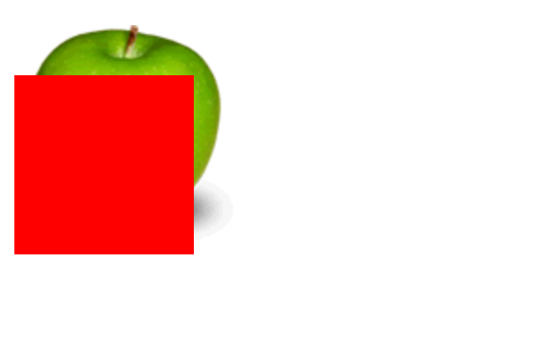

## z-index 的用法

z-index 属性指定一个元素的堆叠顺序，拥有更高堆叠顺序的元素总是会处于堆叠顺序较低的元素的前面。

### 使用

- 必须在定位元素（position:relative/absolute/fixed/sticky, 即其 position 属性值不是 static）上才有效
- 可以有负值
- 不同父元素的子元素之间进行显示时，会根据父级元素的 z-index 进行渲染.

```html
<style>
  div {
    position: relative;
    background-color: red;
    top: -100;
    left: 0;
    width: 400px;
    height: 400px;
    z-index: 1;
  }
</style>


<div></div>
```


