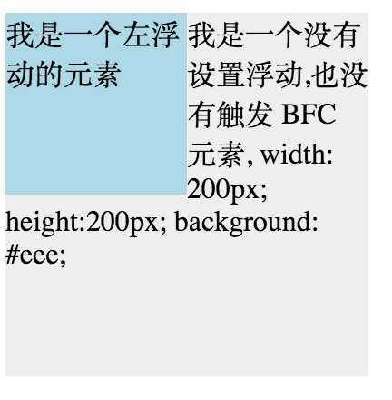
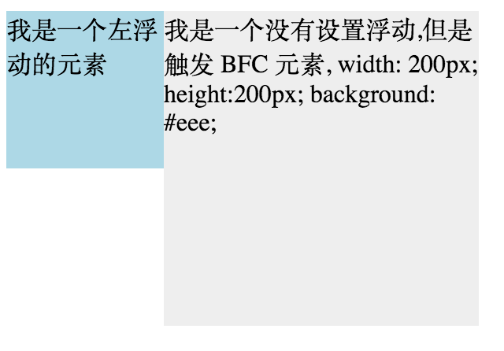
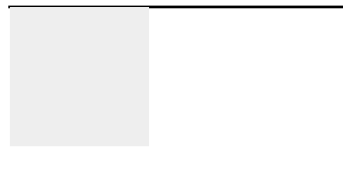
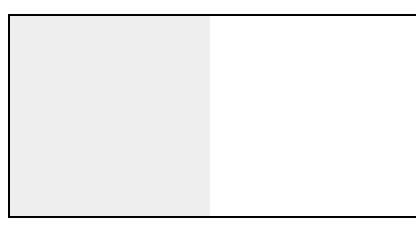

<!--
 * @Author: your name
 * @Date: 2021-02-22 08:13:03
 * @LastEditTime: 2021-02-23 09:15:57
 * @LastEditors: Please set LastEditors
 * @Description: In User Settings Edit
 * @FilePath: \Github-Repositories\Interview-Questions\CSS\README.MD
-->

# CSS 篇

## 介绍下 BFC 及其应用

BFC 即 Block Formatting Contexts (块级格式化上下文)，它是一个独立的渲染区域，只有 Block-level box 参与， 它规定了内部的 Block-level Box 如何布局，并且与这个区域外部毫不相干。

### 触发 BFC

只要元素满足下面任一条件即可触发 BFC 特性：

- body 根元素
- 浮动元素：float 除 none 以外的值
- 绝对定位元素：position (absolute、fixed)
- display 为 inline-block、table-cells、flex
- overflow 除了 visible 以外的值 (hidden、auto、scroll)

块格式化上下文包含创建它的元素内部的所有内容.

浮动定位和清除浮动时只会应用于同一个 BFC 内的元素。浮动不会影响其它 BFC 中元素的布局，而清除浮动只能清除同一 BFC 中在它前面的元素的浮动。外边距折叠（Margin collapsing）也只会发生在属于同一 BFC 的块级元素之间。

### BFC 的布局规则

- 内部的 Box 会在垂直方向，一个接一个地放置（BFC 是一个独立的布局环境，其中的元素布局是不受外界的影响，并且在一个 BFC 中，块盒与行盒（行盒由一行中所有的内联元素所组成）都会垂直的沿着其父元素的边框排列。）。
- Box 垂直方向的距离由 margin 决定。属于同一个 BFC 的两个相邻 Box 的 margin 会发生重叠。
- 在 BFC 中，每一个盒子的左外边缘（margin-left）会触碰到容器的左边缘(border-left)（对于从右到左的格式来说，则触碰到右边缘）
- 形成了 BFC 的区域不会与 float box 重叠
- 计算 BFC 高度时，浮动元素也参与计算

### BFC 特性及应用

#### 同一个 BFC 下外边距会发生折叠（外边距塌陷）

```js
<head>
div{
    width: 100px;
    height: 100px;
    background: lightblue;
    margin: 100px;
}
</head>
<body>
    <div></div>
    <div></div>
</body>
```


因为两个 div 元素都处于同一个 BFC 容器下 (这里指 body 元素) 所以第一个 div 的下边距和第二个 div 的上边距发生了重叠，所以两个盒子之间距离只有 100px，而不是 200px

如果想要避免外边距的重叠，可以将其放在不同的 BFC 容器中。

```html
<div class="container">
  <p></p>
</div>
<div class="container">
  <p></p>
</div>
```

```css
.container {
  overflow: hidden;
}
p {
  width: 100px;
  height: 100px;
  background: lightblue;
  margin: 100px;
}
```


#### BFC 可以包含浮动的元素（清除浮动）

#### BFC 可以阻止元素被浮动元素覆盖

```html
<div style="height: 100px;width: 100px;float: left;background: lightblue">
  我是一个左浮动的元素
</div>
<div style="width: 200px; height: 200px;background: #eee">
  我是一个没有设置浮动, 也没有触发 BFC 元素, width: 200px; height:200px;
  background: #eee;
</div>
```



这时候其实第二个元素有部分被浮动元素所覆盖，(但是文本信息不会被浮动元素所覆盖) 如果想避免元素被覆盖，可触第二个元素的 BFC 特性，让其单独成为一个 BFC（BFC 的区域不会与 float box 重叠），在第二个元素中加入 overflow: hidden，就会变成：



#### BFC 可以清除浮动

当我们不给父节点设置高度，子节点设置浮动的时候，会发生高度塌陷，这个时候我们就要清除浮动。

```html
<div style="border: 1px solid #000;">
  <div style="width: 100px;height: 100px;background: #eee;float: left;"></div>
</div>
```



由于容器内元素浮动，脱离了文档流，所以容器只剩下 2px 的边距高度。如果使触发容器的 BFC(添加 overflow: hidden/auto，或者设置其他的非默认的 overflow: visible 的值)，那么容器将会包裹着浮动元素

```HTML
<div style="border: 1px solid #000;overflow: hidden">
    <div style="width: 100px;height: 100px;background: #eee;float: left;"></div>
</div>
```



_参考文章_
https://developer.mozilla.org/zh-CN/docs/Web/Guide/CSS/Block_formatting_context
https://zhuanlan.zhihu.com/p/25321647
