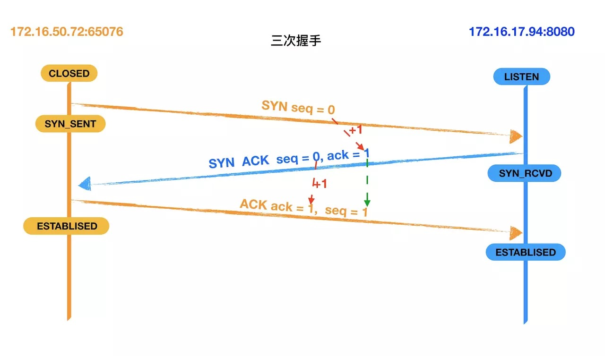
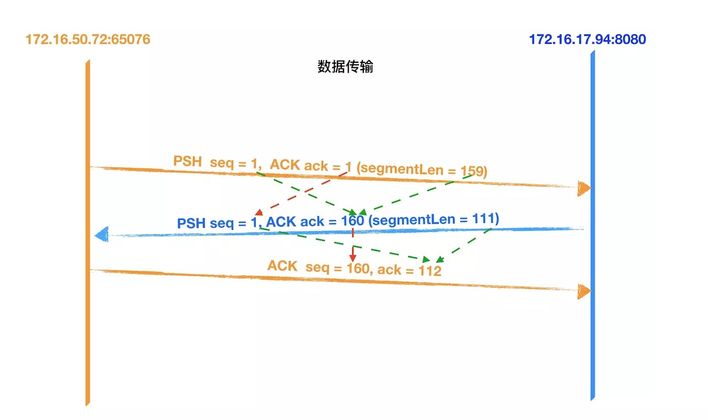
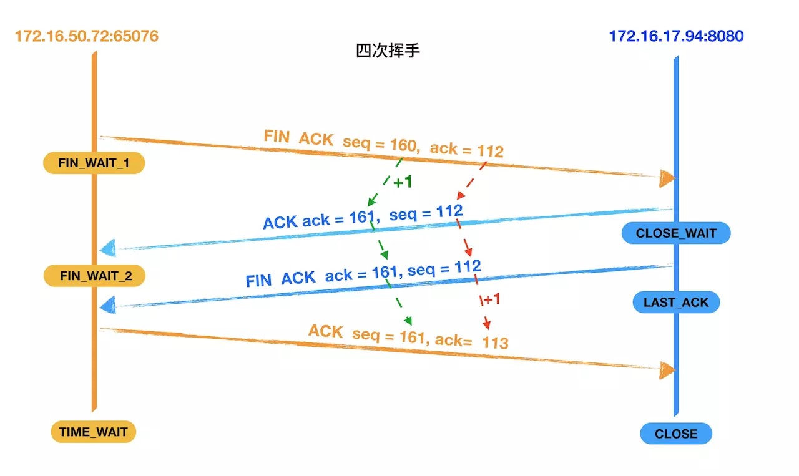

1. 三次握手
   TCP 是面向连接的，无论哪一方向另一方发送数据之前，都必须先在双方之间建立一条连接。在 TCP/IP 协议中，TCP 协议提供可靠的连接服务，连接是通过三次握手进行初始化的。三次握手的目的是同步连接双方的序列号和确认号 并交换 TCP 窗口大小信息。

   

   - 第一次握手: 建立连接。客户端发送连接请求，发送 SYN 报文，将 seq 设置为 0。然后，客户端进入 SYN_SEND 状态，等待服务器的确认。
   - 第二次握手: 服务器收到客户端的 SYN 报文段。需要对这个 SYN 报文段进行确认，发送 ACK 报文，将 ack 设置为 1。同时，自己还要发送 SYN 请求信息，将 seq 为 0。服务器端将上述所有信息一并发送给客户端，此时服务器进入 SYN_RECV 状态。
   - 第三次握手: 客户端收到服务器的 ACK 和 SYN 报文后，进行确认，然后将 ack 设置为 1，seq 设置为 1，向服务器发送 ACK 报文段，这个报文段发送完毕以后，客户端和服务器端都进入 ESTABLISHED 状态，完成 TCP 三次握手。

2. 数据传输
   

   - 客户端先向服务器发送数据，该数据报是长度为 159 的数据。
   - 服务器收到报文后, 也向客户端发送了一个数据进行确认（ACK），并且返回客户端要请求的数据，数据的长度为 111，将 seq 设置为 1，ack 设置为 160（1 + 159）。
   - 客户端收到服务器返回的数据后进行确认（ACK），将 seq 设置为 160， ack 设置为 112（1 + 111）。

3. 四次挥手
   

   - 第一次挥手：客户端向服务器发送一个 FIN 报文段，将设置 seq 为 160 和 ack 为 112，;此时，客户端进入 FIN_WAIT_1 状态,这表示客户端没有数据要发送服务器了，请求关闭连接;
   - 第二次挥手：服务器收到了客户端发送的 FIN 报文段，向客户端回一个 ACK 报文段，ack 设置为 1，seq 设置为 112;服务器进入了 CLOSE_WAIT 状态，客户端收到服务器返回的 ACK 报文后，进入 FIN_WAIT_2 状态;
   - 第三次挥手：服务器会观察自己是否还有数据没有发送给客户端，如果有，先把数据发送给客户端，再发送 FIN 报文；如果没有，那么服务器直接发送 FIN 报文给客户端。请求关闭连接，同时服务器进入 LAST_ACK 状态;
   - 第四次挥手：客户端收到服务器发送的 FIN 报文段，向服务器发送 ACK 报文段，将 seq 设置为 161，将 ack 设置为 113，然后客户端进入 TIME_WAIT 状态;服务器收到客户端的 ACK 报文段以后，就关闭连接;此时，客户端等待 2MSL 后依然没有收到回复，则证明 Server 端已正常关闭，客户端也可以关闭连接了。

### 为什么是三次握手四次挥手

- TCP 是双工的所以，握手需要 3 次。保证双方达成一致 （建立连接浪费性能）
- 当断开链接时，发送（FIN）时另一方需要马上回复 (ACK), 但此时可能不能立即关闭（有未发送完的数据，还有一些准备断开的操作），所以等待确定可以关闭时在发送(FIN)

### 其它

- 为什么需要三次握手? 确保双方收发都是正常的
- 为什么需要四次挥手? 双方数据发送完毕，都认为可以断开
- 为什么需要等待? A 向 B 发的 FIN 可能丢失
- 为什么握手是三次，但挥手却是四次? 当 Server 端收到 FIN 报文时，很可能并不会立即关闭 SOCKET
