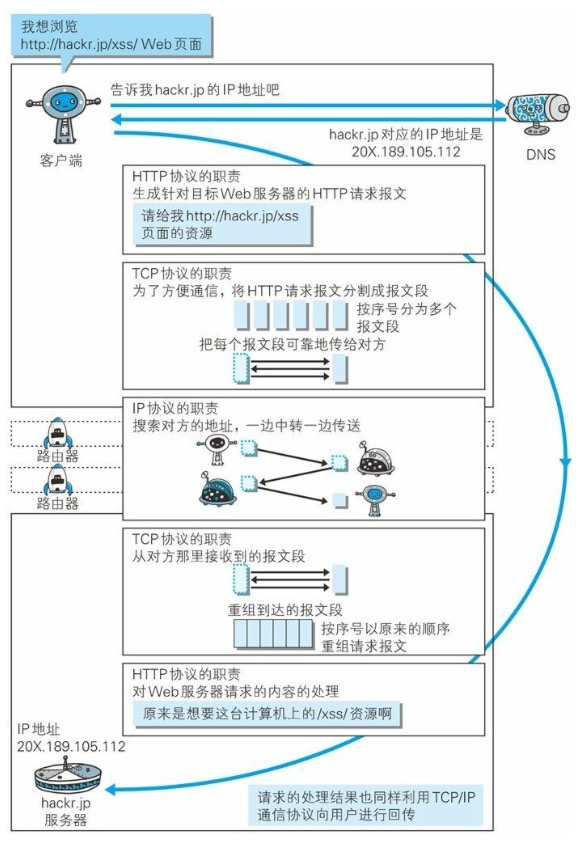

- DNS 解析
- 建立 TCP 连接：三次握手
- 发送 http 请求
- 服务器处理请求并返回 http 报文
- 浏览器解析渲染页面
- 断开 TCP 连接：四次挥手

1. DNS 解析
   比如访问 www.baidu.com，
   - 首先在本地的域名服务器中查找
   - 没找到去根域名服务器查找
   - 没有再去 com 顶级域名服务器查找，没有会再去 baidu.com 服务器查找，以此类推直到找到为止
2. 建立 TCP 连接
   三次握手

3. 发送 http 请求
   TCP 会将 http 报文分割成多个报文段，把每个报文段可靠的传给对方
