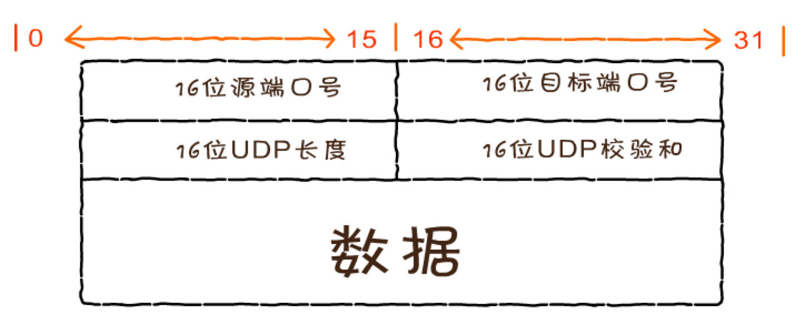

## UDP 协议

- UDP 是一个无连接、不保证可靠性的传输层协议，也就是说发送端不关心发送的数据是否到达目标主机、数据是否出错等，收到数据的主机也不会告诉 发送方是否收到了数据，它的可靠性由上层协议来保障
- 首部结构简单，在数据传输时能实现最小的开销，如果进程想发送很短的报文而对可靠性要求不高可以使用

### UDP 的应用

- QQ
- 视频软件
- TFTP 简单文件传输协议(短信)
