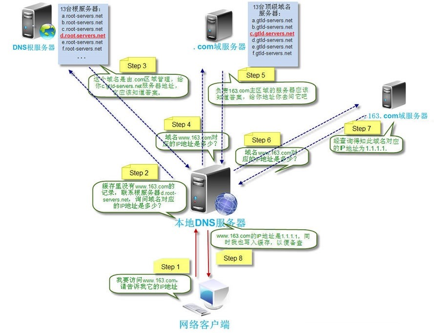

1. DNS 解析
   比如访问 www.baidu.com，

   - 首先搜索`浏览器的DNS缓存`，如果存在，则域名解析到此完成
   - 没有去查找`系统缓存`，即 hosts 文件；
   - 没有去查找`本地域名服务器`
   - 没找到去`根域名服务器`查找
   - 没有再去 com `顶级域名服务器`查找，没有会再去 baidu.com 服务器查找，以此类推直到找到为止

2. DNS 优化
   - DNS 缓存：浏览器缓存，系统缓存，路由器缓存，IPS 服务器缓存，根域名服务器缓存，顶级域名服务器缓存，主域名服务器缓存
   - 负载均衡：一般大公司都有成百上千台服务器来支撑访问，DNS 可以返回一个合适的机器的 IP 给用户，例如可以根据每台机器的负载量，该机器离用户地理位置的距离等等，这种过程就是 DNS 负载均衡
