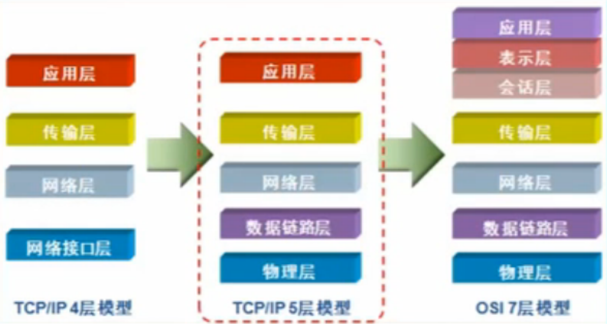
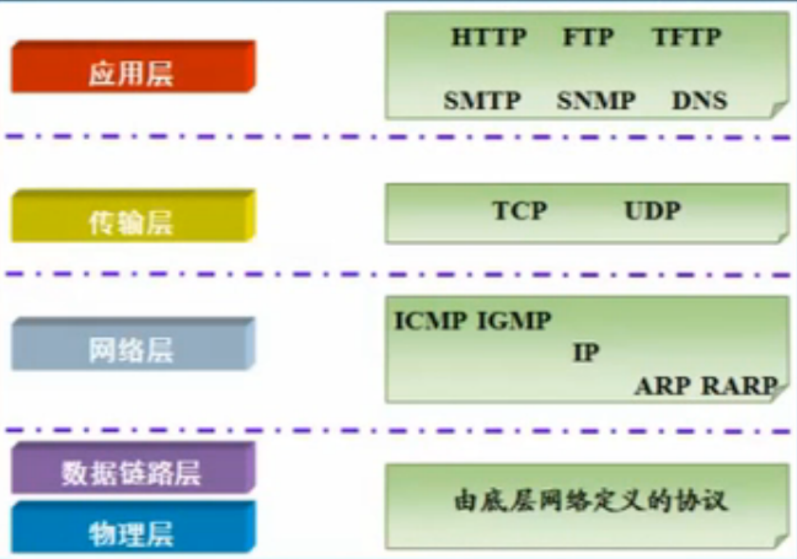

### OSI 七层模型 及 TCP/IP 参考模型

   
   物、数、网、传、应(会表应)

- 应用层(Application) 提供网络与用户应用软件之间的接口服务
- 表示层(Presentation) 提供格式化的表示和转换数据服务，如加密和压缩
- 会话层(Session) 提供包括访问验证和会话管理在内的建立和维护应用之间通信的机制
- 传输层(Transimission) 提供建立、维护和取消传输连接功能，负责可靠地传输数据(PC)
- 网络层(Network) 处理网络间路由，确保数据及时传送(路由器)
- 数据链路层(DataLink) 负责无错传输数据，确认帧、发错重传等(交换机)
- 物理层(Physics) 提供机械、电气、功能和过程特性(网卡、网线、双绞线、同轴电缆、中继器)

### 常用协议

 
