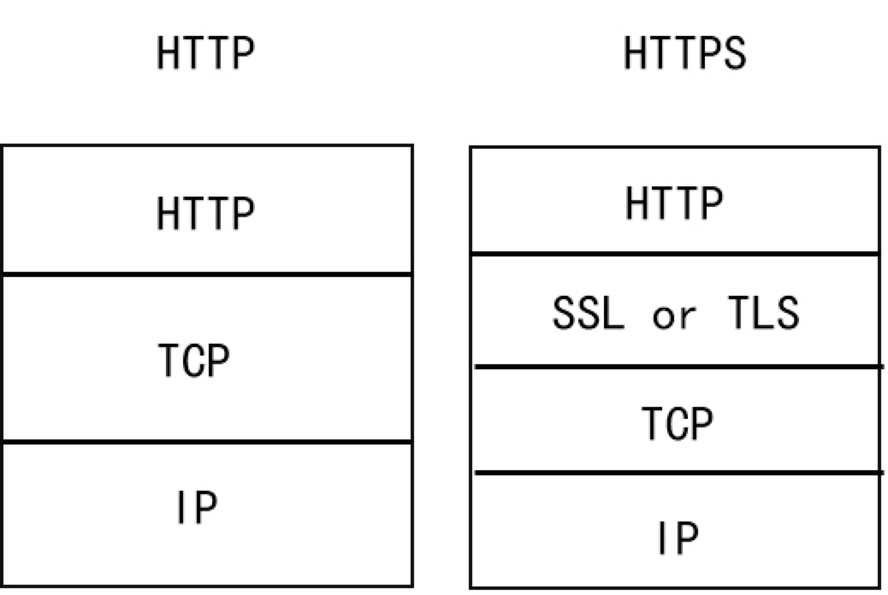

## 20. HTTP 与 HTTPS 区别

https://www.runoob.com/w3cnote/http-vs-https.html

### HTTP

HTTP 默认工作在 TCP 协议 80 端口，用户访问网站 http:// 打头的都是标准 HTTP 服务。
HTTP 协议以明文方式发送内容，不提供任何方式的数据加密，如果攻击者截取了 Web 浏览器和网站服务器之间的传输报文，就可以直接读懂其中的信息，因此，HTTP 协议不适合传输一些敏感信息，比如：信用卡号、密码等支付信息。

### HTTPS

HTTPS 默认工作在 TCP 协议 443 端口。

HTTPS 经由 HTTP 进行通信，但利用 SSL/TLS 来加密数据包，从而保护了交换数据隐私和完整性，提供对网站服务器身份认证的功能，简单来说它就是安全版的 HTTP。

HTTPS 主要用途有三个：一是通过证书等信息确认网站的真实性；二是建立加密的信息通道；三是数据内容的完整性。

HTTPS 默认工作在 TCP 协议 443 端口，它的工作流程一般如以下方式：

- 1、TCP 三次同步握手
- 2、客户端验证服务器数字证书
- 3、DH 算法协商对称加密算法的密钥、hash 算法的密钥
- 4、SSL 安全加密隧道协商完成
- 5、网页以加密的方式传输，用协商的对称加密算法和密钥加密，保证数据机密性；用协商的 hash 算法进行数据完整性保护，保证数据不被篡改

### HTTP 与 HTTPS 区别

- HTTP 明文传输，数据都是未加密的，安全性较差，HTTPS（SSL+HTTP） 数据传输过程是加密的，安全性较好。
- 使用 HTTPS 协议需要到 CA（Certificate Authority，数字证书认证机构） 申请证书，一般免费证书较少，因而需要一定费用。证书颁发机构如：Symantec、Comodo、GoDaddy 和 GlobalSign 等。
- HTTP 页面响应速度比 HTTPS 快，主要是因为 HTTP 使用 TCP 三次握手建立连接，客户端和服务器需要交换 3 个包，而 HTTPS 除了 TCP 的三个包，还要加上 ssl 握手需要的 9 个包，所以一共是 12 个包。
- http 和 https 使用的是完全不同的连接方式，用的端口也不一样，前者是 80，后者是 443。
- HTTPS 其实就是建构在 SSL/TLS 之上的 HTTP 协议，所以，要比较 HTTPS 比 HTTP 要更耗费服务器资源。

### HTTPS 的工作原理

