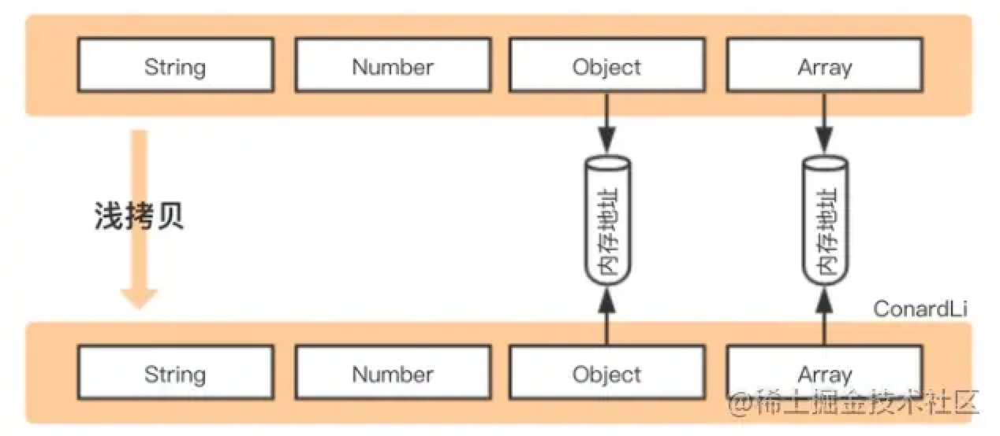
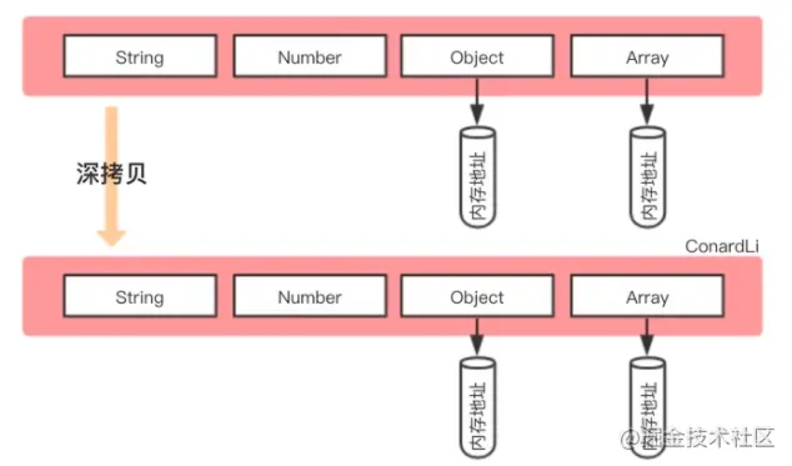

## 深拷贝与浅拷贝

- 浅拷贝是创建一个新对象，这个对象有着原始对象属性值的一份精确拷贝。如果属性是**基本类型**，拷贝的就是基本类型的**值**，如果属性是**引用类型**，**拷贝的就是内存地址** ，所以如果其中一个对象改变了这个地址，就会影响到另一个对象。
- 深拷贝是将一个对象从内存中完整的拷贝一份出来,从堆内存中开辟一个新的区域存放新对象,且修改新对象不会影响原对象。
- 浅拷贝只复制指向某个对象的指针，而不复制对象本身，新旧对象还是共享同一块内存。但深拷贝会另外创造一个一模一样的对象，新对象跟原对象不共享内存，修改新对象不会改到原对象。




1. 浅拷贝

- `Object.assign()`
- `Array.prototype.concat()`
- `Array.prototype.slice()`
- 扩展运算符
- 等号赋值

```js
let a = { a: { name: "zqq", age: 10 } };
let b = a;
b.a.age = 12;
console.log(a); // { a: { name: 'zqq', age: 12 } }
```

2. 深拷贝

- `JSON.parse()`和 `JSON.stringify()`配合使用

  ```js
  const obj1 = { name: "dog", info: { age: 3 }, fn: function () {} };
  const obj2 = JSON.parse(JSON.stringify(obj1));
  obj2.name = "cat";
  obj2.info.age = 4;
  console.log(obj1); // { name: 'dog', info: { age: 3 }, fn: function(){} }
  console.log(obj2); // { name: 'cat', info: { age: 4 } }
  ```

- 手写

  ```js
  function deepClone(source) {
    // null数据需要特殊处理
    if (source === null) {
      return source;
    }
    // 校验要拷贝的数据是对象还是数组
    const target = Array.isArray(source) ? [] : {};
    for (const k in source) {
      const val = source[k];
      const valueType = typeof val;
      // 校验拷贝的数据类型
      if (valueType === "function") {
        target[k] = new Function(`return ${val.toString()}`)();
      } else if (valueType === "object") {
        target[k] = deepClone(val);
      } else {
        target[k] = val;
      }
    }
    return target;
  }

  const obj1 = { name: "dog", info: { age: 3 }, fn: function () {} };
  const obj2 = deepClone(obj1);
  obj2.name = "cat";
  obj2.info.age = 4;
  console.log(obj1); // { name: 'dog', info: { age: 3 }, fn: function(){} }
  console.log(obj2); // { name: 'cat', info: { age: 4 }, fn: function(){} }
  ```
