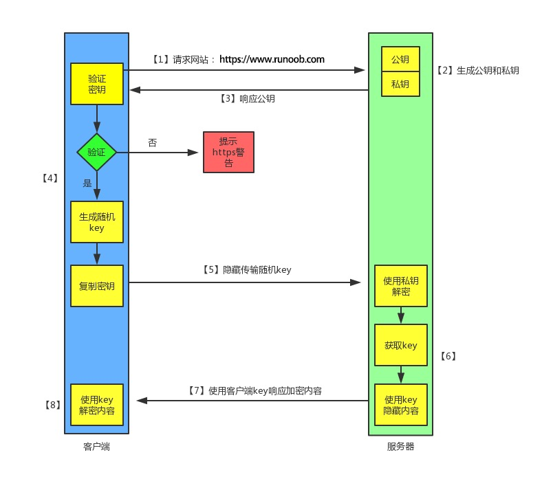

<!--
 * @Author: your name
 * @Date: 2021-03-10 13:54:14
 * @LastEditTime: 2021-04-15 16:39:12
 * @LastEditors: Please set LastEditors
 * @Description: In User Settings Edit
 * @FilePath: /crystal-github/Interview-Questions/JavaScript/README2.md
-->

# JavaScript 篇 (part2)

## 16. var、let 和 const 区别的实现原理是什么

> 变量生命周期：声明（作用域注册一个变量）、初始化（分配内存，初始化为 undefined）、赋值 （[进一步了解可点击这里](https://github.com/dishui1238/Notes/blob/master/JS/03%E5%8F%98%E9%87%8F%E5%AF%B9%E8%B1%A1.md)）

- var：遇到有 var 的作用域，在任何语句执行前都已经完成了声明和初始化，也就是变量提升而且拿到 undefined 的原因由来
- function： 声明、初始化、赋值一开始就全部完成，所以函数的变量提升优先级更高
- let：解析器进入一个块级作用域，发现 let 关键字，变量只是先完成声明，并没有到初始化那一步。此时如果在此作用域提前访问，则报错 xx is not defined，这就是暂时性死区的由来。等到解析到有 let 那一行的时候，才会进入初始化阶段。如果 let 的那一行是赋值操作，则初始化和赋值同时进行
- const、class 都是同 let 一样的道理

```js
console.log(a); // Uncaught ReferenceError: a is not defined #暂时性死区的表现

let a = 1;
```

```js
console.log(b); // undefined
console.log(c); // ƒ c() {}

var b = 2;
function c() {}
```

对比于 var，let、const 只是解耦了声明和初始化的过程，var 是在任何语句执行前都已经完成了声明和初始化，let、const 仅仅是在任何语句执行前只完成了声明

## 17. 如何清空一个数组

1. 重新赋值一个空数组

```js
let a = [1, 2, 3];
a = [];
```

原始数组并未改变，只改变了指针指向，并且不适用于 const

2. 将数组长度置为 0

```js
const a = [1, 2, 3];
a.length = 0;
```

3. Array.prototype.splice()

```js
let a = [1, 2, 3, 4];
a.splice(0, a.length);
```

4. Array.prototype.pop() (不推荐，性能较差)

```js
let a = [1, 2, 3, 4];
while (a.length) a.pop();
```

## 18. 全局作用域中，用 const 和 let 声明的变量不在 window 上，那到底在哪里？如何去获取？

在 ES5 中，顶层对象的属性和全局变量是等价的，var 命令和 function 命令声明的全局变量，自然也是顶层对象。

```js
var a = 12;
function f() {}

console.log(window.a); // 12
console.log(window.f); // f(){}
```

但 ES6 规定，var 命令和 function 命令声明的全局变量，依旧是顶层对象的属性，但 let 命令、const 命令、class 命令声明的全局变量，不属于顶层对象的属性。

```js
let aa = 1;
const bb = 2;

console.log(window.aa); // undefined
console.log(window.bb); // undefined
```


通过上图也可以看到，在全局作用域中，用 let 和 const 声明的全局变量并没有在全局对象中，只是一个块级作用域（Script）中,
怎么获取？在定义变量的块级作用域中就能获取，既然不属于顶层对象，那就不加 window（global）。

## 19.介绍下前端加密的常见场景和方法

### 常见加密方法

点击查看 https://juejin.cn/post/6844903695428091918

1.  Base64 编码

Base64 适用于小段内容的编码，比如数字证书签名、Cookie 的内容等；而且 Base64 也是一种通过查表的编码方法，不能用于加密，如果需要加密，请使用专业的加密算法

2. 哈希算法（Hash）

哈希（Hash）是将目标文本转换成具有固定长度的字符串（或叫做消息摘要），哈希算法是不可逆的

基于哈希算法的特性，其适用于该场景：被保护数据仅仅用作比较验证且不需要还原成明文形式。比较常用的哈希算法是 MD5 和 SHA1

3. 加盐（Adding Salt）

加盐加密是一种对系统登录口令的加密方式，它实现的方式是将每一个口令同一个叫做“盐”（salt）的 n 位随机数相关联。盐值其实就是我们添加的一串随机字符串。这样处理之后，相同的字符串每次都会被加密为完全不同的字符串。

使用加盐加密时需要注意以下两点：（1）短盐值（Short Slat）（2）盐值复用（Salt Reuse）

4. 慢哈希函数（Slow Hash Function）

5. 密钥哈希

6. XOR

7. 加密（Encrypt）

   根据加密、解密所用的密钥是否相同，可以将加密算法分为对称加密、非对称加密

   (1) 对称加密

   密钥是相同的，常见的对称加密算法有 DES、AES 等

   (2) 非对称加密

   加密、解密所用的密钥是不同的，分为公钥和私钥，常见的非对称加密算法有 RSA、DSA 等

### 场景

1. 密码传输

   使用 Base64 / Unicode+1 等方式加密成非明文，后端解开之后再存它的 MD5/MD6

   直接使用 MD5/MD6 之类的方式取 Hash ，让后端存 Hash 的 Hash

2. 数据包加密

   使用 HTTPS

3. 展示成果加密 (防止爬虫爬取数据)

   [Web 端反爬虫技术方案](https://juejin.cn/post/6844903654810468359)

## 20. HTTP 与 HTTPS 区别

https://www.runoob.com/w3cnote/http-vs-https.html

### HTTP

HTTP 默认工作在 TCP 协议 80 端口，用户访问网站 http:// 打头的都是标准 HTTP 服务。
HTTP 协议以明文方式发送内容，不提供任何方式的数据加密，如果攻击者截取了 Web 浏览器和网站服务器之间的传输报文，就可以直接读懂其中的信息，因此，HTTP 协议不适合传输一些敏感信息，比如：信用卡号、密码等支付信息。

### HTTPS

HTTPS 默认工作在 TCP 协议 443 端口。

HTTPS 经由 HTTP 进行通信，但利用 SSL/TLS 来加密数据包，从而保护了交换数据隐私和完整性，提供对网站服务器身份认证的功能，简单来说它就是安全版的 HTTP。


HTTPS 主要用途有三个：一是通过证书等信息确认网站的真实性；二是建立加密的信息通道；三是数据内容的完整性。

HTTPS 默认工作在 TCP 协议 443 端口，它的工作流程一般如以下方式：

- 1、TCP 三次同步握手
- 2、客户端验证服务器数字证书
- 3、DH 算法协商对称加密算法的密钥、hash 算法的密钥
- 4、SSL 安全加密隧道协商完成
- 5、网页以加密的方式传输，用协商的对称加密算法和密钥加密，保证数据机密性；用协商的 hash 算法进行数据完整性保护，保证数据不被篡改

### HTTP 与 HTTPS 区别

- HTTP 明文传输，数据都是未加密的，安全性较差，HTTPS（SSL+HTTP） 数据传输过程是加密的，安全性较好。
- 使用 HTTPS 协议需要到 CA（Certificate Authority，数字证书认证机构） 申请证书，一般免费证书较少，因而需要一定费用。证书颁发机构如：Symantec、Comodo、GoDaddy 和 GlobalSign 等。
- HTTP 页面响应速度比 HTTPS 快，主要是因为 HTTP 使用 TCP 三次握手建立连接，客户端和服务器需要交换 3 个包，而 HTTPS 除了 TCP 的三个包，还要加上 ssl 握手需要的 9 个包，所以一共是 12 个包。
- http 和 https 使用的是完全不同的连接方式，用的端口也不一样，前者是 80，后者是 443。
- HTTPS 其实就是建构在 SSL/TLS 之上的 HTTP 协议，所以，要比较 HTTPS 比 HTTP 要更耗费服务器资源。

### HTTPS 的工作原理



## 21. setTimeout、Promise、Async/Await 的区别

1. setTimeout
   settimeout 的回调函数放到宏任务队列里，等到执行栈清空以后执行

2. Promise
   Promise 本身是同步的立即执行函数，回调函数会被放到 微任务队列 中

3. Async/Await
   async 函数返回一个 Promise 对象，当函数执行的时候，一旦遇到 await 就会先返回，等到触发的异步操作完成，再执行函数体内后面的语句。可以理解为，是让出了线程，跳出了 async 函数体。
