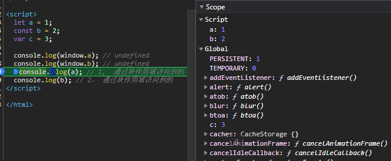

<!--
 * @Author: your name
 * @Date: 2021-03-10 13:54:14
 * @LastEditTime: 2021-04-12 17:17:48
 * @LastEditors: Please set LastEditors
 * @Description: In User Settings Edit
 * @FilePath: /crystal-github/Interview-Questions/JavaScript/README2.md
-->

# JavaScript 篇 (part2)

## 16. var、let 和 const 区别的实现原理是什么

> 变量生命周期：声明（作用域注册一个变量）、初始化（分配内存，初始化为 undefined）、赋值 （[进一步了解可点击这里](https://github.com/dishui1238/Notes/blob/master/JS/03%E5%8F%98%E9%87%8F%E5%AF%B9%E8%B1%A1.md)）

- var：遇到有 var 的作用域，在任何语句执行前都已经完成了声明和初始化，也就是变量提升而且拿到 undefined 的原因由来
- function： 声明、初始化、赋值一开始就全部完成，所以函数的变量提升优先级更高
- let：解析器进入一个块级作用域，发现 let 关键字，变量只是先完成声明，并没有到初始化那一步。此时如果在此作用域提前访问，则报错 xx is not defined，这就是暂时性死区的由来。等到解析到有 let 那一行的时候，才会进入初始化阶段。如果 let 的那一行是赋值操作，则初始化和赋值同时进行
- const、class 都是同 let 一样的道理

```js
console.log(a); // Uncaught ReferenceError: a is not defined #暂时性死区的表现

let a = 1;
```

```js
console.log(b); // undefined
console.log(c); // ƒ c() {}

var b = 2;
function c() {}
```

对比于 var，let、const 只是解耦了声明和初始化的过程，var 是在任何语句执行前都已经完成了声明和初始化，let、const 仅仅是在任何语句执行前只完成了声明

## 17. 如何清空一个数组

1. 重新赋值一个空数组

```js
let a = [1, 2, 3];
a = [];
```

原始数组并未改变，只改变了指针指向，并且不适用于 const

2. 将数组长度置为 0

```js
const a = [1, 2, 3];
a.length = 0;
```

3. Array.prototype.splice()

```js
let a = [1, 2, 3, 4];
a.splice(0, a.length);
```

4. Array.prototype.pop() (不推荐，性能较差)

```js
let a = [1, 2, 3, 4];
while (a.length) a.pop();
```

## 18. 全局作用域中，用 const 和 let 声明的变量不在 window 上，那到底在哪里？如何去获取？

在 ES5 中，顶层对象的属性和全局变量是等价的，var 命令和 function 命令声明的全局变量，自然也是顶层对象。

```js
var a = 12;
function f() {}

console.log(window.a); // 12
console.log(window.f); // f(){}
```

但 ES6 规定，var 命令和 function 命令声明的全局变量，依旧是顶层对象的属性，但 let 命令、const 命令、class 命令声明的全局变量，不属于顶层对象的属性。

```js
let aa = 1;
const bb = 2;

console.log(window.aa); // undefined
console.log(window.bb); // undefined
```


通过上图也可以看到，在全局作用域中，用 let 和 const 声明的全局变量并没有在全局对象中，只是一个块级作用域（Script）中,
怎么获取？在定义变量的块级作用域中就能获取，既然不属于顶层对象，那就不加 window（global）。
