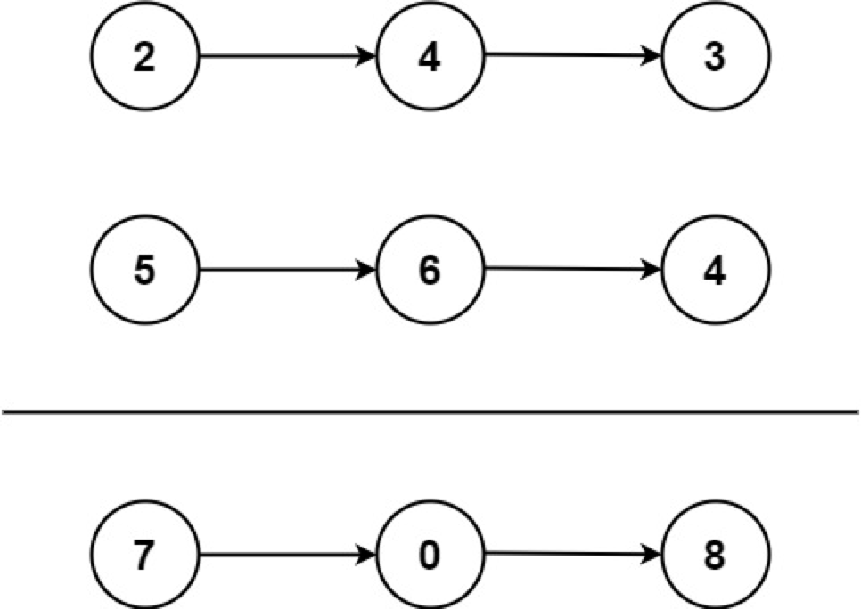

## 两数相加(链表)

```
给你两个 非空 的链表，表示两个非负的整数。它们每位数字都是按照 逆序 的方式存储的，并且每个节点只能存储 一位 数字。

请你将两个数相加，并以相同形式返回一个表示和的链表。

你可以假设除了数字 0 之外，这两个数都不会以 0 开头。
```



```
示例：
输入：l1 = [2,4,3], l2 = [5,6,4]
输出：[7,0,8]
解释：342 + 465 = 807.
```

```js
/**
 * Definition for singly-linked list.
 * function ListNode(val, next) {
 *     this.val = (val===undefined ? 0 : val)
 *     this.next = (next===undefined ? null : next)
 * }
 */
/**
 * @param {ListNode} l1
 * @param {ListNode} l2
 * @return {ListNode}
 */
var addTwoNumbers = function (l1, l2) {
  let head = null,
    tail = null;
  let carray = 0; // 进位

  while (l1 || l2) {
    const n1 = l1 ? l1.val : 0;
    const n2 = l2 ? l2.val : 0;
    const sum = n1 + n2 + carray;

    if (!head) {
      head = tail = new ListNode(sum % 10);
    } else {
      tail.next = new ListNode(sum % 10);
      tail = tail.next;
    }
    carray = Math.floor(sum / 10); // 取十位上的数字

    if (l1) l1 = l1.next;
    if (l2) l2 = l2.next;
  }

  // 有 carry>0，需要在答案链表的后面附加一个节点
  if (carray > 0) {
    tail.next = new ListNode(carray);
  }
  return head;
};
```
