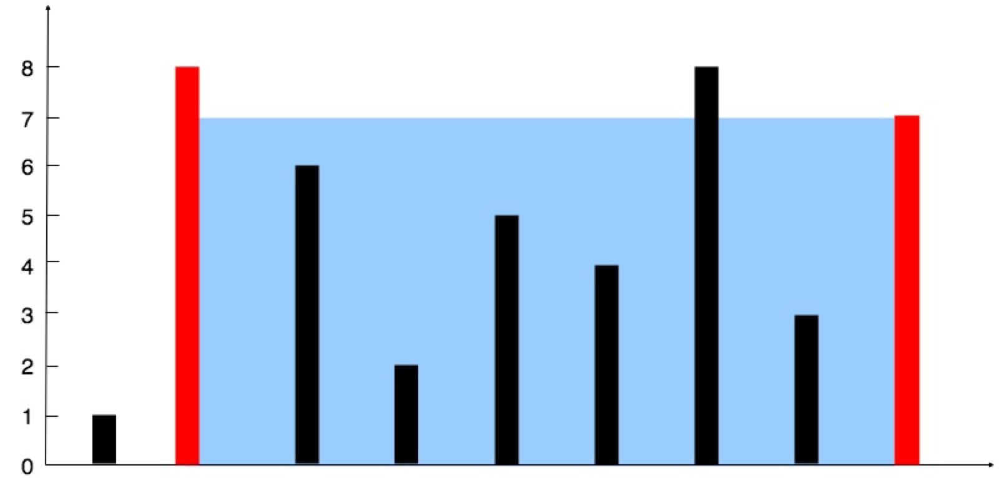

## 盛水最多的容器

给你 n 个非负整数 a1，a2，...，an，每个数代表坐标中的一个点  (i, ai) 。在坐标内画 n 条垂直线，垂直线 i  的两个端点分别为  (i, ai) 和 (i, 0) 。找出其中的两条线，使得它们与  x  轴共同构成的容器可以容纳最多的水。

说明：你不能倾斜容器。

示例：


```
输入：[1,8,6,2,5,4,8,3,7]
输出：49
解释：图中垂直线代表输入数组 [1,8,6,2,5,4,8,3,7]。在此情况下，容器能够容纳水（表示为蓝色部分）的最大值为 49
```

双指针：

1. 左右指针分别指向第一位和最后一位数据；计算 `res = area = Min(height[left], height[right])*(right - left)`
2. 将数字较小的指针指向向中间移动一位，再次计算 area， `res = Max(area, res)`
3. 两指针相遇则结束，时间复杂度 O(n)

```js
/**
 * @param {number[]} height
 * @return {number}
 */
var maxArea = function (height) {
  const len = height.length;
  let res = 0;
  let area = 0;
  let left = 0;
  let right = len - 1;
  while (left < right) {
    area = Math.min(height[left], height[right]) * (right - left);
    res = Math.max(area, res);
    if (height[left] <= height[right]) {
      left++;
    } else {
      right--;
    }
  }
  return res;
};
```
