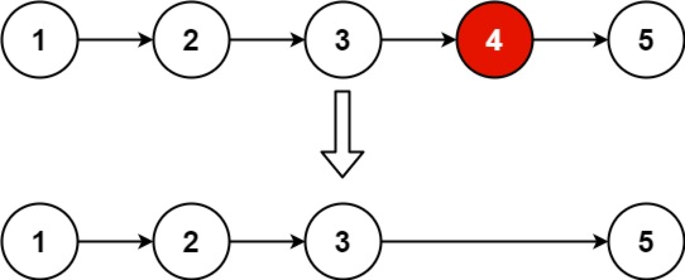

## 删除链表的倒数第 N 个节点

给你一个链表，删除链表的倒数第 n 个结点，并且返回链表的头结点。

进阶：你能尝试使用一趟扫描实现吗？



```
输入：head = [1,2,3,4,5], n = 2
输出：[1,2,3,5]
```

### 题解

在对链表进行操作时，一种常用的技巧是添加一个哑节点（dummy node），它的 \textit{next}next 指针指向链表的头节点。这样一来，我们就不需要对头节点进行特殊的判断了。

```js
function ListNode(val, next) {
  this.val = val === undefined ? 0 : val;
  this.next = next === undefined ? null : next;
}
const head = {
  val: 1,
  next: new ListNode(2, new ListNode(3, new ListNode(4, null))),
};
/**
 * @param {ListNode} head
 * @param {number} n
 * @return {ListNode}
 */

const getLength = (head) => {
  let length = 0;
  while (head) {
    head = head.next;
    ++length;
  }
  return length;
};
// 0--->1--->2--->3--->4
var removeNthFromEnd = function (head, n) {
  const dummy = new ListNode(0, head); // 哑节点
  const length = getLength(head);
  let currentNode = dummy;
  for (i = 1; i < length - n + 1; i++) {
    currentNode = currentNode.next;
  }
  currentNode.next = currentNode.next.next;
  return dummy.next;
};

console.log(removeNthFromEnd(head, 2));
```
