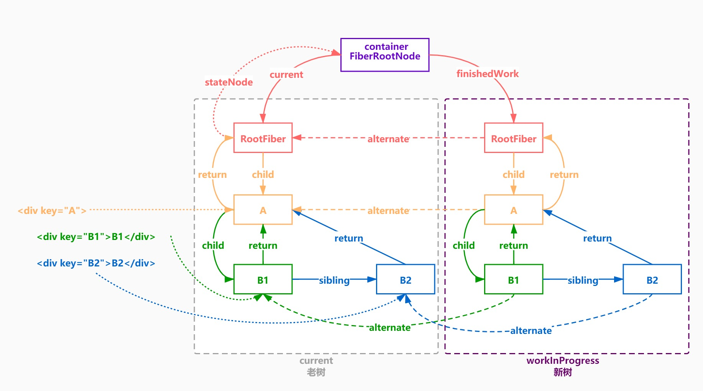
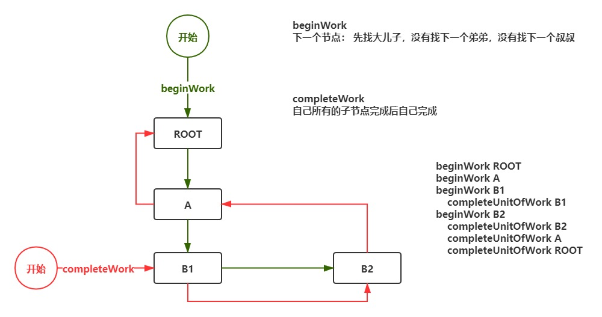

## 什么是 fiber

1. fiber 是一种数据结构
   在 react 内部，每个 vdom 节点都被表示为一个 fiber

   ```js
    FiberNode {
       // 实例属性
       this.tag = tag; // 标记不同组件类型，如函数组件、类组件、文本、原生组件...
       this.key = key; // react 元素上的 key 就是 jsx 上写的那个 key ，也就是最终 ReactElement 上的
       this.elementType = null; // createElement 的第一个参数，ReactElement 上的 type
       this.type = null; // 表示 fiber 的真实类型 ，elementType 基本一样，在使用了懒加载之类的功能时可能会不一样
       this.stateNode = null; // 实例对象，比如 class 组件 new 完后就挂载在这个属性上面，如果是 RootFiber，那么它上面挂的是 FiberRoot,如果是原生节点就是 dom 对象
       // fiber
       this.return = null; // 父节点，指向上一个 fiber
       this.child = null; // 子节点，指向自身下面的第一个 fiber
       this.sibling = null; // 兄弟组件, 指向一个兄弟节点
       this.index = 0; // 一般如果没有兄弟节点的话是 0 当某个父节点下的子节点是数组类型的时候会给每个子节点一个 index，index 和 key 要一起做 diff
       this.ref = null; // reactElement 上的 ref 属性
       this.pendingProps = pendingProps; // 新的 props
       this.memoizedProps = null; // 旧的 props
       this.updateQueue = null; // fiber 上的更新队列执行一次 setState 就会往这个属性上挂一个新的更新, 每条更新最终会形成一个链表结构，最后做批量更新
       this.memoizedState = null; // 对应 memoizedProps，上次渲染的 state，相当于当前的 state，理解成 prev 和 next 的关系
       this.mode = mode; // 表示当前组件下的子组件的渲染方式
       // effects
       this.effectTag = NoEffect; // 表示当前 fiber 要进行何种更新
       this.nextEffect = null; // 指向下个需要更新的 fiber
       this.firstEffect = null; // 指向所有子节点里，需要更新的 fiber 里的第一个
       this.lastEffect = null; // 指向所有子节点中需要更新的 fiber 的最后一个
       this.expirationTime = NoWork; // 过期时间，代表任务在未来的哪个时间点应该被完成
       this.childExpirationTime = NoWork; // child 过期时间
       this.alternate = null; // current 树和 workInprogress 树之间的相互引用
   }
   ```

2. fiber 树
   react 内 vdom 树结构都被表示为 fiber，就形成了 fiber 树
   

3. fiber 是一个执行单元
   每次执行完一个执行单元, React 就会检查现在还剩多少时间，如果没有时间就将控制权让出去
   
