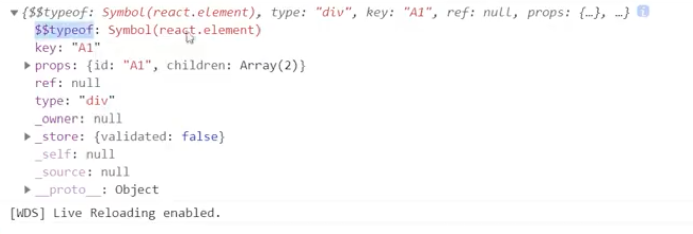

## 说一下对 vdom 的理解

1. 是什么？

   - 描述真实 dom 的纯 js 对象
   - `React.createElement` 函数所返回的就是一个虚拟 DOM

   

   ```js
   import React from "react";
   let virtualDOM = (
     <div id="A1" key="A1">
       <div id="B1" key="B1">
         B1
       </div>
       <div id="B2" key="B2">
         B2
       </div>
     </div>
   );

   // 上面等同于
   let virtualDOM = React.createElement('div',{id:'A1',key:'A1',onClick:()=>console.log('A1')},
   React.createElement('div',{id:'B1',key:'B1'},'<script>B2</script>'),
   React.createElement('div',{id:'B2',key:'B2'},'B2'),
   concole.log(virtualDOM);
   ```

   ```js
   const RESERVED_PROPS = {
     key: true,
     ref: true,
     __self: true,
     __source: true,
   };
   /**
    *
    * @param {*} type 元素的类型
    * @param {*} config 配置对象
    * @param {*} children 大儿子
    */
   export function createElement(type, config, children) {
     const props = {};
     //key是用来标识每一个稳定的元素的
     let key = null;
     if (config !== null) {
       key = config.key;
     }
     for (let propName in config) {
       if (!RESERVED_PROPS.hasOwnProperty(propName)) {
         props[propName] = config[propName];
       }
     }
     const childrenLength = arguments.length - 2;
     if (childrenLength === 1) {
       props.children = children;
     } else if (childrenLength > 1) {
       const childArray = Array(childrenLength);
       for (let i = 0; i < childrenLength; i++) {
         childArray[i] = arguments[i + 2];
       }
       props.children = childArray;
     }
     //React.createElement方法返回是一个普通的JS对象，它可以描述元素样子，它就是所谓的虚拟DOm/
     //虚拟DOM是跨平台，跟平台无关
     const element = {
       $$typeof: REACT_ELEMENT_TYPE,
       type,
       key,
       props,
     };
     return element;
   }
   ```

2. 优缺点

- 优点：
  - 处理了浏览器的兼容性问题，避免用户操作真实 dom，麻烦且容易出错
  - 内容经过了 XSS 处理，可以防范 XSS 攻击(React DOM 在渲染所有输入内容之前，默认会进行转义,所有的内容在渲染之前都被转换成了字符串)
  - 容易实现跨平台开发，Android、IOS
  - 更新的时候可以实现差异化更新，减少更新 dom 操作
- 缺点：
  - 需要消耗额外的内存
  - 首次渲染不一定快（在更新的时候，更新的元素内容比较少，可以实现精准的定量更新）
