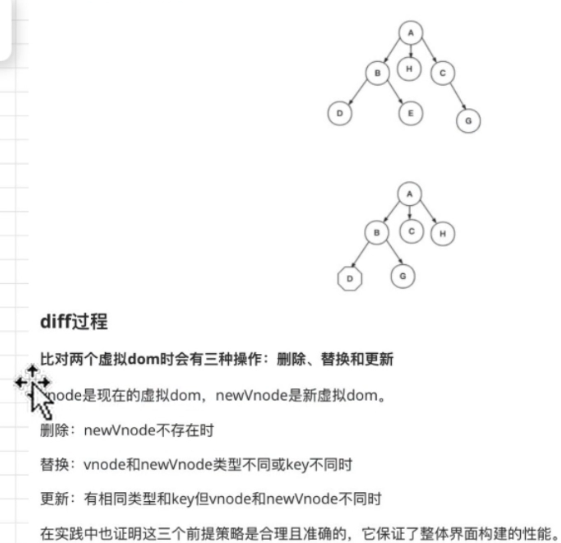

## 说一下 React 中的 dom-diff 算法

> 在 React17+中 DOM-DIFF 就是根据老的 fiber 树和最新的 JSX 对比生成新的 fiber 树的过程

### react diff 的优化原则

react 的 dom diff 算法复杂度为 O(n)，react 为降低算法复杂度做了三个限制：

- 只对`同级节点`进行对比，如果 DOM 节点跨层级移动，则 React 不会复用
- 不同类型的元素不会进行复用，比如元素由 div 变为 p，会销毁老元素，创建新元素
- 可以通过 key 标识移动的元素

  ```html
  <!-- 更新前 -->
  <div>
    <p key="p">这是一个 p</p>
    <div key="div">这是一个 div</div>
  </div>

  <!-- 更新后 -->
  <div>
    <h1 key="h">这是一个 div</h1>
    <p key="p">这是一个 p</p>
  </div>
  ```

  如果没有 key，React 会认为 div 的第一个子节点由 p 变为 h1，第二个子节点由 div 变为 p。这符合限制 2 的设定，会销毁并新建。
  但是当我们用 key 指明了节点前后对应关系后，React 知道 key === "p"的 p 在更新后还存在，所以 DOM 节点可以复用，只是需要交换下顺序。

### diff 实现

```js
// 根据newChild类型选择不同diff函数处理
function reconcileChildFibers(
  returnFiber: Fiber,
  currentFirstChild: Fiber | null,
  newChild: any
): Fiber | null {
  const isObject = typeof newChild === "object" && newChild !== null;

  if (isObject) {
    // object类型，可能是 REACT_ELEMENT_TYPE 或 REACT_PORTAL_TYPE
    switch (newChild.$typeof) {
      case REACT_ELEMENT_TYPE:
      // 调用 reconcileSingleElement 处理
      // ...其他case
    }
  }

  if (typeof newChild === "string" || typeof newChild === "number") {
    // 调用 reconcileSingleTextNode 处理
  }

  if (isArray(newChild)) {
    // 调用 reconcileChildrenArray 处理
  }

  // 一些其他情况调用处理函数

  // 以上都没有命中，删除节点
  return deleteRemainingChildren(returnFiber, currentFirstChild);
}
```

当 newChild 类型为 `object、number、string`，代表同级只有一个节点
当 newChild 类型为 `Array`，同级有多个节点

#### 1. 同级只有一个节点的 diff(新节点只有一个)


#### 2. 同级多个节点的 diff

React 团队发现，在日常开发中，相对于增加和删除，更新组件发生的频率更高。所以 React Diff 会优先判断当前节点是否属于更新。

双指针从数组头和尾同时遍历以提高效率，但是这里却不行。为什么呢？

虽然本次更新的 JSX 对象 newChildren 为数组形式，但是和 newChildren 中每个值进行比较的是上次更新的 Fiber 节点，Fiber 节点的同级节点是由 sibling 指针链接形成的链表。即 newChildren[0]与 oldFiber 比较，newChildren[1]与 oldFiber.sibling 比较

基于以上原因，Diff 算法的整体逻辑会经历两轮遍历。

第一轮遍历：处理更新的节点。

第二轮遍历：处理剩下的不属于更新的节点。

##### 第一轮遍历

第一轮遍历步骤如下：

1. 遍历 newChildren，i = 0，将 newChildren[i]与 oldFiber 比较，判断 DOM 节点是否可复用。
2. 如果可复用，i++，比较 newChildren[i]与 oldFiber.sibling 是否可复用。可以复用则重复步骤
3. 如果不可复用，立即跳出整个遍历。
4. 如果 newChildren 遍历完或者 oldFiber 遍历完（即 oldFiber.sibling === null），跳出遍历。

分析可能结果：

1. 如果是步骤 3 跳出遍历，newChildre 和 oldFiber 都没有遍历完，这意味着有节点在这次更新中改变了位置。
2. newChildren 和 oldFiber 有一个遍历完了
   - 如果 newChildren 遍历完，oldFiber 没遍历完，说明删除了节点，需要在遍历剩下的 fiber 打上删除的 effectTag (`Fiber.effectTag = Deletion`);
   - 如果 oldFiber 遍历完，newChildren 没遍历完，说明新增了节点，要遍历剩下的 newChildren 依次执行插入操作`（Fiber.effectTag = Placement）`

##### 处理位置交换的节点

为了快速找到 key 对应的 fiber，react 把还没处理的 fiber 放到一个 map 中，key 属性为 key, value 为 fiber

维护一个 lastPlacedIndex，该变量表示当前最后一个可复用节点，对应的 oldFiber 在上一次更新中所在的位置索引。我们通过这个变量判断节点是否需要移动

```js
let lastPlacedIndex = 0;
```

```js
// 之前
abcd

// 之后
dabc

===第一轮遍历开始===
d（之后）vs a（之前）
key改变，不能复用，跳出遍历
===第一轮遍历结束===

===第二轮遍历开始===
newChildren === dabc，没用完，不需要执行删除旧节点
oldFiber === abcd，没用完，不需要执行插入新节点

将剩余oldFiber（abcd）保存为map

继续遍历剩余newChildren

// 当前oldFiber：abcd
// 当前newChildren dabc

key === d 在 oldFiber中存在
const oldIndex = d（之前）.index;
此时 oldIndex === 3; // 之前节点为 abcd，所以d.index === 3
比较 oldIndex 与 lastPlacedIndex;
oldIndex 3 > lastPlacedIndex 0
则 lastPlacedIndex = 3;
d节点位置不变

继续遍历剩余newChildren

// 当前oldFiber：abc
// 当前newChildren abc

key === a 在 oldFiber中存在
const oldIndex = a（之前）.index; // 之前节点为 abcd，所以a.index === 0
此时 oldIndex === 0;
比较 oldIndex 与 lastPlacedIndex;
oldIndex 0 < lastPlacedIndex 3
则 a节点需要向右移动

继续遍历剩余newChildren

// 当前oldFiber：bc
// 当前newChildren bc

key === b 在 oldFiber中存在
const oldIndex = b（之前）.index; // 之前节点为 abcd，所以b.index === 1
此时 oldIndex === 1;
比较 oldIndex 与 lastPlacedIndex;
oldIndex 1 < lastPlacedIndex 3
则 b节点需要向右移动

继续遍历剩余newChildren

// 当前oldFiber：c
// 当前newChildren c

key === c 在 oldFiber中存在
const oldIndex = c（之前）.index; // 之前节点为 abcd，所以c.index === 2
此时 oldIndex === 2;
比较 oldIndex 与 lastPlacedIndex;
oldIndex 2 < lastPlacedIndex 3
则 c节点需要向右移动

===第二轮遍历结束===


```



比较两个虚拟 dom 时会有三种操作：删除、更新、替换

- 删除：当新的 dom 树上该节点不存在时
- 替换：新节点的类型和老节点不相同或 key 不同时
- 更新：有相同类型的 key 但是新节点和老节点不同时（如： 属性更新）

参考：https://juejin.cn/post/6844904167472005134
