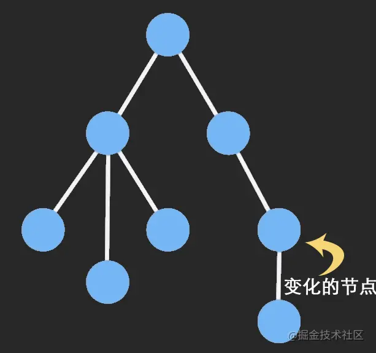

## ImmutableJS 是什么

> Immutable.js 出自 Facebook。Immutable Data 就是一旦创建，就不能再被更改的数据。对 Immutable 对象的任何修改或添加删除操作都会返回一个新的 Immutable 对象。Immutable 实现的原理是 Persistent Data Structure（**持久化数据结构**），也就是使用旧数据创建新数据时，要保证旧数据同时可用且不变。同时为了避免 deepCopy 把所有节点都复制一遍带来的性能损耗，Immutable 使用了 Structural Sharing（**结构共享**），即如果对象树中一个节点发生变化，只修改这个节点和受它影响的父节点，其它节点则进行共享。请看下面动画：



### Immutable.js 的几种数据类型

- List: 有序索引集，类似 JavaScript 中的 Array。
- Map: 无序索引集，类似 JavaScript 中的 Object。
- OrderedMap: 有序的 Map，根据数据的 set()进行排序。
- Set: 没有重复值的集合。
- OrderedSet: 有序的 Set，根据数据的 add 进行排序。
- Stack: 有序集合，支持使用 unshift()和 shift()添加和删除。
- Record: 一个用于生成 Record 实例的类。类似于 JavaScript 的 Object，但是只接收特定字符串为 key，具有默认值。
- Seq: 序列，但是可能不能由具体的数据结构支持。
- Collection: 是构建所有数据结构的基类，不可以直接构建

### Immutable.js 的常用 API

1. fromJS()
   将一个 js 数据转换为 Immutable 类型的数据，深度转换，会将内部嵌套的对象和数组全部转成 immutable
   用法：`fromJS(value, converter)`
   简介：value 是要转变的数据，converter 是要做的操作。第二个参数可不填，默认情况会将数组准换为 List 类型，将对象转换为 Map 类型，其余不做操作
2. toJS()
   将一个 Immutable 数据转换为 JS 类型的数据，(深度转换，会将内部嵌套的Map和List全部转换成原生js)
   用法：value.toJS()
3. is()
   对两个对象进行比较
   用法：is(map1,map2)
   简介：和 js 中对象的比较不同，在 js 中比较两个对象比较的是地址，但是在 Immutable 中比较的是这个对象 hashCode 和 valueOf，只要两个对象的 hashCode 相等，值就是相同的，避免了深度遍历，提高了性能
4. List() 和 Map()
   用来创建一个新的 List/Map 对象/原生 object 转 Map 对象 (只会转换第一层，注意和 fromJS 区别)
   ```js
   //List
   Immutable.List(); // 空List
   Immutable.List([1, 2]);
   //Map
   Immutable.Map(); // 空 Map
   Immutable.Map({ a: "1", b: "2" });
   ```
5. size
   属性，获取 List/Map 的长度
6. get() 、 getIn()
   获取数据结构中的数据

   ```js
   //获取List索引的元素
   ImmutableData.get(0);
   // 获取 Map 对应 key 的 value
   ImmutableData.get("a");
   // 获取嵌套数组中的数据
   ImmutableData.getIn([1, 2]);
   // 获取嵌套 map 的数据
   ImmutableData.getIn(["a", "b"]);
   ```

7. has() 、 hasIn()
   判断是否存在某一个 key
